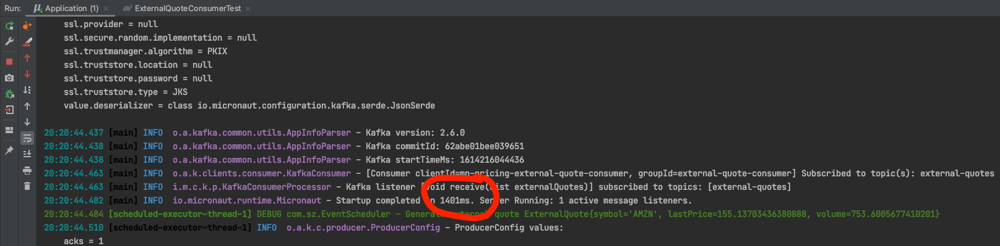
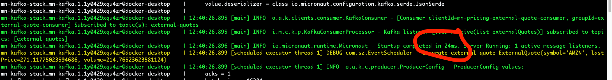

# mn-kafka (GraalVM)

## To use GraalVM if project does not select micronaut native image feature in creation
* add lib to build.gradle
* add src/main/resources/META-INF/native-image/native-image.properties
* modify Dockerfile
* use `@Introspected` in pojo, since graalVM is Ahead Of Time (AOT) that does not use reflection.
* to build
    * `./gradlew clean assemble`
    * `docker build . -t mn-kafka`
#### Start time comparison
* Run Application.java (start time 1401ms)

* Run with docker native image (start time 24 ms)
  * at local, create `app.stack.yml` to link `mn-kafka` and `kafka` server
  * `docker stack deploy -c app.stack.yml mn-kafka-stack`
  * see app logs: `docker service logs -f mn-kafka-stack_mn-kafka`

  
